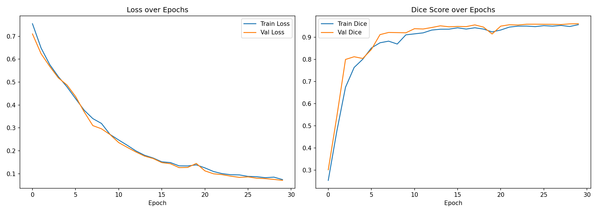
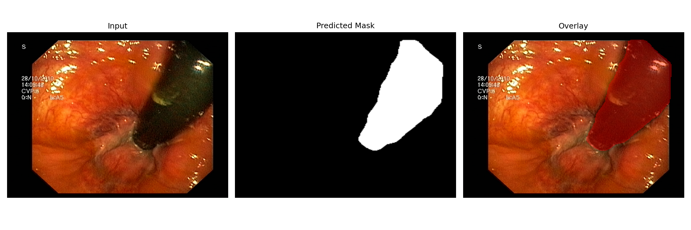
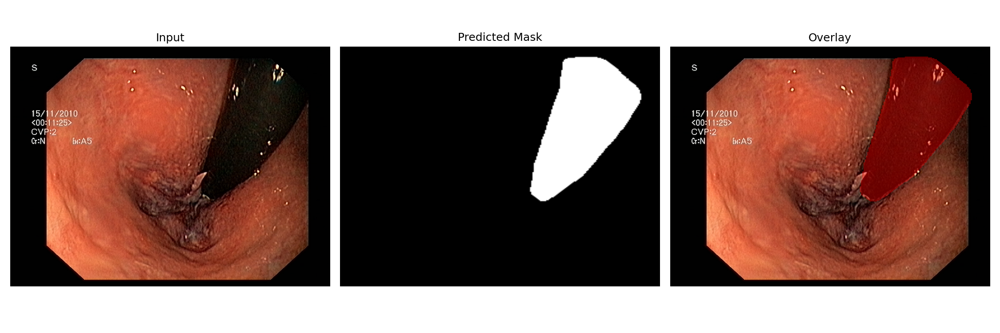
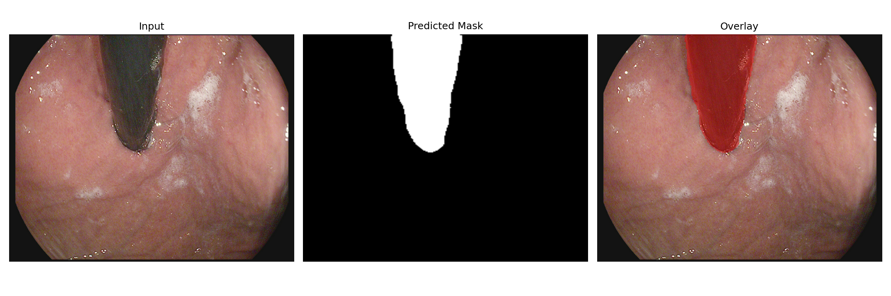
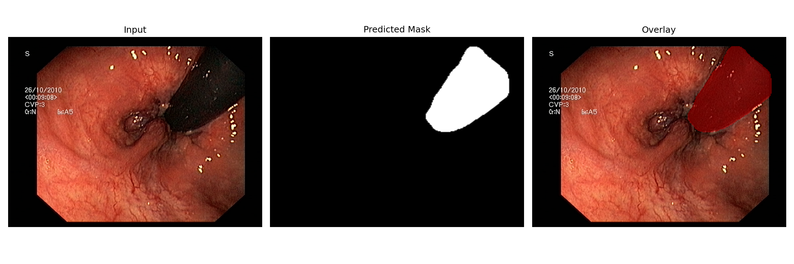
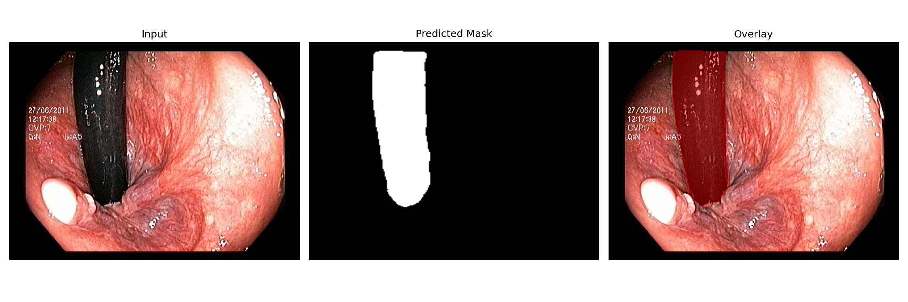

# Surgical Instrument Segmentation in Endoscopic Video

A U-Net segmentation model that identifies surgical instruments in endoscopic video frames, built with an eye toward a specific downstream use case: real-time AR guidance during minimally invasive procedures. Every design decision below — the backbone choice, the evaluation protocol, the uncertainty estimation — was made with that constraint in mind, not just to maximize a benchmark number.

## Why this problem, and why this framing

Instrument segmentation is the first building block of any system that overlays guidance on a surgeon's live video feed: before you can highlight a tool, track it, or warn about proximity to tissue, you need to know where it is in every frame. This project builds and evaluates that first block — it does **not** build an AR system (see Limitations).

Two things matter clinically for this building block that a generic segmentation project usually ignores:

1. **Inference speed**, because a model that can't keep up with video frame rate is not usable for live guidance, however accurate it is on a static test set.
2. **Knowing when the model doesn't know**, because a silent wrong prediction overlaid on a surgeon's screen is worse than no prediction at all.

Both of these shaped the pipeline, described below.

## Dataset

[Kvasir-Instrument](https://datasets.simula.no/kvasir-instrument/) — 590 annotated frames extracted from real gastrointestinal endoscopy procedures, with pixel-level ground-truth masks for surgical tools. The dataset ships with an official train/test split (not a random one), which this project uses throughout so results are comparable to other work on the same benchmark.

The raw data is not tracked in this repo (see `.gitignore`) since it's a large public dataset available directly from the source. To reproduce, download and extract it into `data/`:

```bash
mkdir -p data
wget -O data/kvasir-instrument.zip "https://files.osf.io/v1/resources/kp6my/providers/osfstorage/?zip="
unzip data/kvasir-instrument.zip -d data
tar -xzf data/images.tar.gz -C data
tar -xzf data/masks.tar.gz -C data
```

This produces `data/images/`, `data/masks/`, and the official train/test split files (`files_used_for_training.txt`, `files_used_for_testing.txt`) used throughout this project.

## Model and backbone selection

Architecture: U-Net with an ImageNet-pretrained encoder (`segmentation-models-pytorch`), trained with Dice loss.

Rather than defaulting to a single backbone, four candidates were compared on a short training run, scored on both segmentation quality (Dice) and inference latency (ms/frame, batch size 1):

| Backbone | Val Dice | Inference (ms/frame) | Params (M) |
|---|---|---|---|
| EfficientNet-B0 | 0.908 | 9.6 | 6.3 |
| MobileNetV2 | 0.895 | 6.3 | 6.6 |
| ResNet50 | 0.870 | 8.7 | 32.5 |
| ResNet34 | 0.859 | 6.3 | 24.4 |

**Chosen backbone: MobileNetV2.** It trails EfficientNet-B0 by only ~1.3 Dice points while being roughly 35% faster at inference — a better trade-off for a latency-sensitive use case, where frame rate matters as much as raw segmentation accuracy. This is the kind of trade-off a benchmark leaderboard doesn't surface, but a deployment context does.

The final model was then trained for 30 epochs on the full training set with this backbone.

## Results

- **Final validation Dice: 0.961**
- **Test-set Dice (single forward pass): 0.9324**
- **Test-set Dice (with test-time augmentation): 0.9415**

Training curves (loss and Dice over 30 epochs) are in `results/training_curves.png`.



### Test-time augmentation (TTA)

At inference, each frame is also run through horizontal flip, vertical flip, and 90° rotation, and the four predictions are averaged. This improved test-set Dice from 0.9324 to 0.9415 — a modest but consistent gain, and the averaging step is cheap enough to keep in a real-time pipeline if the frame budget allows it.

### Uncertainty estimation

The same four TTA predictions also give a free uncertainty signal: the pixel-wise standard deviation across them. High-disagreement regions are typically where an instrument's edge is ambiguous, partially occluded, or where lighting/blood obscures the boundary — exactly the cases where a clinician would want a system to flag "I'm not confident here" rather than overlay a wrong boundary silently. Example maps are in `results/uncertainty_maps.png`.

### Simulated active-learning acquisition

Using the same uncertainty scores, test images were ranked by how uncertain the model was on them (`results/acquisition_ranking.json`). In a real active-learning pipeline, the highest-uncertainty samples would be the ones prioritized for expert (surgeon) labeling in the next annotation round, since they carry the most information about where the model is currently failing.

**Honesty note:** this is a single ranking step, not a full active-learning loop. No retraining on newly labeled data was performed — this demonstrates the acquisition criterion, not a complete active-learning system.

## Demo

The GIF below shows the live dashboard: a test frame is uploaded on the left, and the model's predicted instrument mask is overlaid on the right in real time.


### Sample predictions

A few frames from the test sequence, showing the predicted instrument mask overlaid on the original image:

<p align="center">
  
  
  
  
  
</p>

## Limitations — what this project is *not*

Being direct about scope matters more here than in a generic ML demo, because the stated motivation is a clinical/surgical context:

- **This is not an AR system.** It's the segmentation building block one would sit underneath AR guidance. There is no 3D registration, no tracking across frames, no integration with a live camera feed, and no latency budget was validated end-to-end on real video — only per-frame inference time on static images.
- **Single-center, single-dataset.** All training and evaluation used Kvasir-Instrument, sourced from one set of procedures. No cross-dataset or cross-center generalization test (analogous to what was done with PolypGen in the polyp segmentation project) was performed here. Performance on a different endoscope, hospital, or instrument type is unverified.
- **Not validated on continuous video.** The dataset is a set of independently sampled frames, not a continuous recording. Frame-to-frame temporal consistency (a real live feed would need this) was never tested.
- **Not a clinical decision tool.** Nothing here should inform an actual surgical decision. It's a portfolio-scale demonstration of the modeling and evaluation approach.
- **Active learning is simulated, not implemented end-to-end**, as noted above.

## Repository structure

```
surgical-instrument-segmentation/
├── models/
│   └── best_model.pth
├── results/
│   ├── history.json
│   ├── training_curves.png
│   ├── tta_comparison.json
│   ├── uncertainty_maps.png
│   ├── acquisition_ranking.json
│   └── dashboard_demo.gif
├── notebooks/
│   ├── surgical_instrument_segmentation_full_output.ipynb   # with all cell outputs (plots, logs) rendered
│   └── surgical_instrument_segmentation_clean.ipynb          # same code, outputs cleared, easier to read/diff
└── README.md
```

## Related work in this portfolio

This is the fifth project in a series of medical ML/imaging projects, following a chest X-ray pneumonia classifier and a colon polyp segmentation project (the latter also used TTA and uncertainty estimation, applied here again with the added acquisition-ranking step). The next project moves from perception to action: an imitation-learning model that predicts motion/action sequences from expert demonstrations — a natural continuation, since a system that first needs to *see* where an instrument is (this project) is a prerequisite for a system that later needs to *act* based on what it sees.
